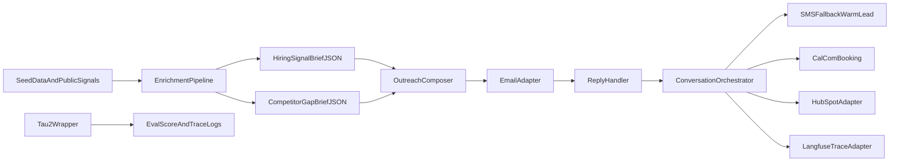

# The Conversion Engine

Automated lead generation and conversion system for Tenacious Consulting and Outsourcing.

This repository contains the interim (Acts I and II) implementation:
- Act I: reproducible tau2-bench baseline artifacts with CI/cost/latency.
- Act II: production-stack skeleton with email-first outreach, SMS warm-lead scheduling fallback, HubSpot and Cal.com event flow, enrichment briefs, and observability traces.

## Architecture

## Repository Layout

- `agent/`: orchestration, enrichment, policy guards, and integration adapters.
- `eval/`: tau2 wrapper, score/trace outputs, and run metadata.
- `infra/`: kill-switch documentation and smoke tests.
- `artifacts/interim/`: generated interim evidence artifacts.
- `report/interim_report.md`: structured content for the interim PDF.
- `baseline.md`: Act I baseline write-up (<=400 words).

## Requirements

- Python 3.11+
- Install dependencies:
  - `python -m pip install -r agent/requirements.txt`

## Setup

1. Copy `.env.example` to `.env` and fill provider credentials.
2. Keep `TENACIOUS_OUTBOUND_ENABLED` unset for challenge-safe sink routing.
3. Run smoke tests:
   - Bash: `bash infra/smoke_test.sh`
   - PowerShell: `powershell -ExecutionPolicy Bypass -File infra/smoke_test.ps1`

## Act I Commands

- Generate canonical eval artifacts from source traces:
  - `python -m eval.run_tau2_wrapper`

Outputs:
- `eval/score_log.json`
- `eval/trace_log.jsonl`
- `eval/run_metadata.json`

## Act II Commands

- Run one synthetic prospect end-to-end flow:
  - `python -m agent.scripts.run_single_flow`
- Run 20-interaction latency batch:
  - `python -m agent.scripts.run_latency_batch`

Outputs:
- `artifacts/interim/single_prospect_flow/hiring_signal_brief.json`
- `artifacts/interim/single_prospect_flow/competitor_gap_brief.json`
- `artifacts/interim/single_prospect_flow/hubspot_record_snapshot.json`
- `artifacts/interim/single_prospect_flow/cal_booking_snapshot.json`
- `artifacts/interim/single_prospect_flow/single_flow_summary.json`
- `artifacts/interim/latency_batch/interaction_trace_log.jsonl`
- `artifacts/interim/latency_batch/latency_summary.json`

## Interim Evidence Snapshot

- tau2 pass@1 (empirical): `0.7267`
- tau2 95% CI: `[0.6504, 0.7917]`
- tau2 avg cost/simulation: `$0.0199`
- tau2 p50/p95 latency (seconds): `105.9521 / 551.6491`
- interaction batch count: `20`
- interaction p50/p95 latency (seconds): `185.0 / 336.65`

## Policy and Guardrails

- Kill switch and sink routing: `infra/killswitch.md`
- Data handling policy source: `source_file/tenacious_sales_data/tenacious_sales_data/policy/data_handling_policy.md`
- Draft metadata propagation:
  - Email header `X-Tenacious-Status: draft`
  - HubSpot field `tenacious_status=draft`
- Honesty constraints enforced through guardrail checks:
  - weak hiring signal
  - bench mismatch
  - unsupported competitor-gap confidence

## Submission Mapping

Use `artifacts/interim/submission_checklist.md` to map each interim requirement to exact files and evidence artifacts.
