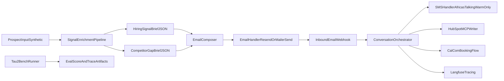

# Interim Submission Report (Acts I and II)

## Project

The Conversion Engine for Sales Automation (Tenacious Consulting and Outsourcing)

## Reporting Window

Interim submission scope aligned to the project specification requirements for the interim report:

- Architecture overview and key design decisions
- Production stack status coverage
- Enrichment pipeline status and outputs
- Competitor gap brief status
- tau2-bench baseline and methodology
- p50/p95 latency from at least 20 interactions
- Honest status and forward plan

## 1) System Architecture Diagram and Design Rationale

### Design Rationale

- **Email-first channel policy:** outreach starts on email to match ICP behavior (founders/CTOs/VP Engineering), with SMS only after warm engagement.
- **Evidence-first composition:** enrichment runs before message generation and feeds confidence-aware language controls.
- **Policy-safe outbound:** kill-switch sink routing is default-safe when outbound enable flag is unset.
- **Traceable operations:** all key events are correlation-id tagged for auditability across channel handlers and orchestration steps.
- **Benchmark fidelity:** baseline metrics are generated from raw tau2 traces and published in canonical `eval` artifacts.

## 2) Production Stack Status Coverage

### Email (Resend or MailerSend)

- Implemented provider-ready handler with both integrations.
- Includes try/except error handling and explicit failure events (`email_send_failed`).
- Inbound webhook route available via `POST /webhooks/email`.
- Handles replies, bounces, failed sends, unknown/malformed payloads, and bad webhook secret.

### SMS (Africa's Talking)

- Implemented provider-ready Africa's Talking send path.
- Inbound webhook route available via `POST /webhooks/sms`.
- Warm-channel gate enforced: SMS is blocked unless prior email engagement exists.
- Handles send failures and malformed/unauthorized webhook payloads explicitly.

### HubSpot Developer Sandbox (MCP layer)

- Contact upsert, enrichment metadata write, and timeline event append flow implemented in adapter layer.
- Draft safety metadata included (`tenacious_status=draft`).

### Cal.com

- Booking link generation and booking confirmation capture implemented.
- Booking state is written back into orchestration artifacts for report traceability.

### Langfuse

- Event-level tracing integrated with correlation id metadata for outbound, inbound, and booking transitions.

## 3) Enrichment Pipeline Documentation

The enrichment pipeline produces `hiring_signal_brief.json` and `competitor_gap_brief.json` before first outreach.

### Inputs and Signal Collectors

- **Crunchbase ODM firmographics/funding:** public-source fetch path implemented with defensive fallback and source status tracking.
- **Job-post velocity scraping:** Playwright-based public-page scrape path implemented (no login, no captcha bypass behavior).
- **layoffs.fyi integration:** layoffs CSV parse path implemented with source status and error capture.
- **Leadership-change detection:** public-page/announcement scan path implemented.
- **AI maturity scoring (0-3):** computed from collected signals with confidence annotations in justifications.

### Output Contract

- Schema validation runs against:
  - `hiring_signal_brief.schema.json`
  - `competitor_gap_brief.schema.json`
- Output includes:
  - per-signal confidence
  - `data_sources_checked` with `success/partial/error`
  - honesty flags (weak signal, bench gap, etc.)
  - bench-to-brief stack feasibility

### Competitor Gap Brief Status

- Pipeline generated `competitor_gap_brief.json` for test prospect `orrin-labs.example`.
- Output includes peer set, top-quartile benchmark, and confidence-tagged gap findings.

## 4) Benchmark and Interaction Metrics

### tau2-bench Baseline (Act I)

Source: `eval/score_log.json`

- pass@1: `0.7267`
- 95% CI: `[0.6504, 0.7917]`
- average agent cost/simulation: `$0.0199`
- p50 latency: `105.9521s`
- p95 latency: `551.6491s`
- evaluated simulations: `150`

Method: wrapper reproduces score artifacts from raw dev-slice traces and recomputes 95% CI from reward outcomes.

### Interaction Latency (Act II)

Source: `artifacts/interim/latency_batch/latency_summary.json`

- interaction count: `20`
- p50 latency: `185.0s`
- p95 latency: `336.65s`
- mean latency: `202.0s`

## 5) Honest Status Report and Forward Plan

### What Is Working

- End-to-end synthetic flow executes through enrichment, email, reply handling, warm SMS handoff, booking, and event capture.
- Baseline benchmark artifacts are reproducible and reportable.
- Core policy controls are in place (kill-switch defaults, draft metadata, warm-channel gating, malformed webhook handling).

### What Is Not Fully Complete Yet

- Live account verification for provider APIs depends on active credentials and environment-specific connectivity.
- Some public-signal endpoints may fail at runtime; pipeline captures this explicitly in source-status metadata and falls back safely.
- Final submission should replace synthetic evidence snapshots with live sandbox screenshots where required.

### Forward Plan (Remaining Days)

- Validate all provider integrations against live sandbox credentials (Resend/MailerSend, Africa's Talking, HubSpot, Cal.com, Langfuse).
- Increase interaction volume beyond 20 for stronger latency confidence bands.
- Harden enrichment reliability (stable source mirrors, retry/backoff, deterministic parse tests).
- Add probe-driven checks for over-claiming, bench mismatch, and tone drift before final submission.

## 6) Network Administrator Section

### Deployment and Connectivity Requirements

- Open outbound HTTPS (443) to:
  - `api.resend.com`
  - `api.mailersend.com`
  - `api.africastalking.com`
  - HubSpot API endpoints
  - Cal.com endpoints
  - Langfuse cloud endpoint
- Allow inbound webhook traffic to:
  - `/webhooks/email`
  - `/webhooks/sms`
- Ensure DNS resolution and TLS inspection policy does not break webhook signature/secret checks.

### Security and Ops Controls

- Store API keys in environment variables; never commit secrets.
- Keep `TENACIOUS_OUTBOUND_ENABLED` unset by default in non-production testing.
- Log webhook rejections and malformed payloads for SOC/audit review.
- Monitor 4xx/5xx webhook rates and provider timeout rates as early warning signals.

### Handover Notes

- Webhook service startup command:
  - `uvicorn agent.webhooks:app --host 0.0.0.0 --port 8000`
- Smoke verification:
  - `powershell -ExecutionPolicy Bypass -File infra/smoke_test.ps1`

---

Prepared for interim submission package alongside repository evidence artifacts and baseline files.
